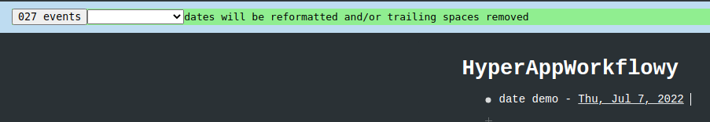
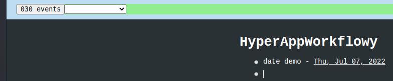

# HyperAppWorkflowy
HyperApp applied to Workflowy

Currently developed and tested in Chromium/Linux

1. Install [Tampermonkey](https://www.tampermonkey.net/)
2. Install this script via this link: [HyperAppWorkflowy.user.js](https://github.com/markfirmware/HyperAppWorkflowy/raw/master/HyperAppWorkflowy.user.js)

Single digit dates are reformatted with a leading 0.

